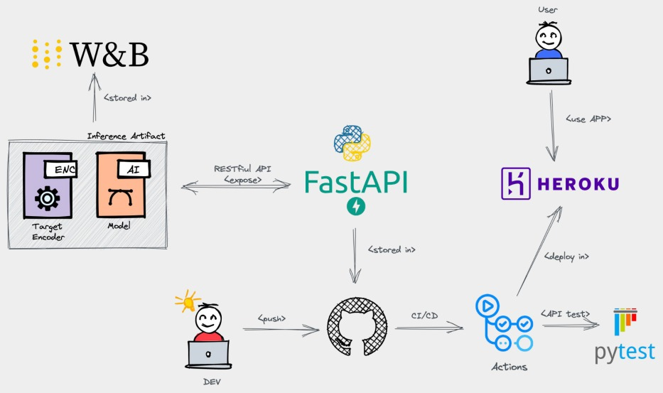

# Bank Marketing Prediction - A Multilayer Perceptron (MLP) Approach
This work is part of the evaluation of the EEC1509 Machine Learning course of the Department of Computer Engineering and Automation Graduate Program in Electrical and Computer Engineering, Federal University of Rio Grande do Norte.

### Team
Developers:
- Francisval Guedes ([www.linkedin.com/in/francisval](https://www.linkedin.com/in/francisval-guedes-soares-6094772a))
- Hareton Gomes ([www.linkedin.com/in/hareton](https://www.linkedin.com/in/hareton-ribeiro-gomes-11123a238/))

Supervisor:
- Prof. Ivanovitch (https://www.linkedin.com/in/ivanovitchm/)

## Links

[Medium Report - Bank Marketing A Multilayer Perceptron (MLP) Approach](https://github.com/francisvalguedes/bank_marketing_mlp/tree/master/model)

[Deployed API - Bank Marketing on Heroku](https://bank-marketing-mlp.herokuapp.com/)

[Repository - Bank Marketing A Multilayer Perceptron (MLP) Approach](https://github.com/francisvalguedes/bank_marketing_mlp)

[Model Card - Bank Marketing A Multilayer Perceptron (MLP) Approach](https://github.com/francisvalguedes/bank_marketing_mlp/tree/master/model)

[Previous Work - Model Card - Bank Marketing Decision Tree](https://github.com/francisvalguedes/bank_marketing/tree/master/classification)

[Dataset - University of California, Irvine's website](http://archive.ics.uci.edu/ml/datasets/Bank+Marketing).

## The data
The data is related with direct marketing campaigns of a Portuguese banking institution. The marketing campaigns were based on phone calls. Often, more than one contact to the same client was required, in order to access if the product (bank term deposit) would be ('yes') or not ('no') subscribed. 

<figure>

<figcaption align = "center"><b>Fig.1 - Marketing</b></figcaption>
</figure>

You can download the data from the [University of California, Irvine's website](http://archive.ics.uci.edu/ml/datasets/Bank+Marketing). The classification goal is to predict if the client will subscribe (yes/no) a term deposit (variable y). More details about the data is presented in the [Model Card](https://github.com/francisvalguedes/bank_marketing_mlp/tree/master/model)

## Machine Learning Model
The machine learning model implemented is the Multilayer Perceptron (MLP) Neural Network and is described in the [Model Card in model folder i this repository](https://github.com/francisvalguedes/bank_marketing_mlp/tree/master/model).

## Workflow
The application uses the workflow shown in BigPicture below. Where is using the artifact stored by the classification model in Wandb and implemented an API from FastAPI. The API is tested with PyTest and deployed with Github Actions making it available on Heroku through automatic CI/CD.

<figure>

<figcaption align = "center"><b>Fig.2 - Deploy Big Picture</b></figcaption>
</figure>

## The API
The API is publicly available to users at the link: [https://bank-marketing-mlp.herokuapp.com/](https://bank-marketing-mlp.herokuapp.com/). It can be tested by accessing the */docs* tab on the site, or consuming the API for example the file [/souce/api/query_live.py](./souce/api/query_live_api.py) souce/api/query_live.py that sends a post with the client's data to the server and receives the prediction as a response.

An improvement was implemented in the API in relation to the first work, now the .html file for the presentation of the site is in the Read more [/source/api/templates/root.html](./source/api/templates/root.html) folder, in addition to this, the [/source/api/static/](./source/api/static/) folder was also created can be used to store pictures and other static objects on the server.

## References:

[[1] MITCHELL, Margaret et al. Model Cards for Model Reporting, 2019. Accessed May 30, 2022. Avaliable](https://arxiv.org/abs/1810.03993).

[[2] University of California, Irvine's website](http://archive.ics.uci.edu/ml/datasets/Bank+Marketing).

[[3] Bank Marketing Data - A Decision Tree Approach](https://www.kaggle.com/code/shirantha/bank-marketing-data-a-decision-tree-approach/notebook).

[[4] Deal Banking Marketing Campaign Dataset With Machine Learning](https://medium.com/@nutanbhogendrasharma/deal-banking-marketing-campaign-dataset-with-machine-learning-9c1f84ad285d).

[[5] Repository for EEC1509, a graduate course on PPgEEC about Machine Learning](https://github.com/ivanovitchm/ppgeecmachinelearning).
