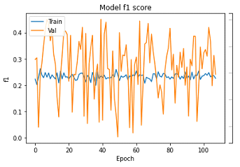
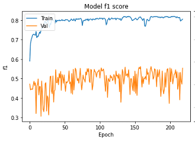
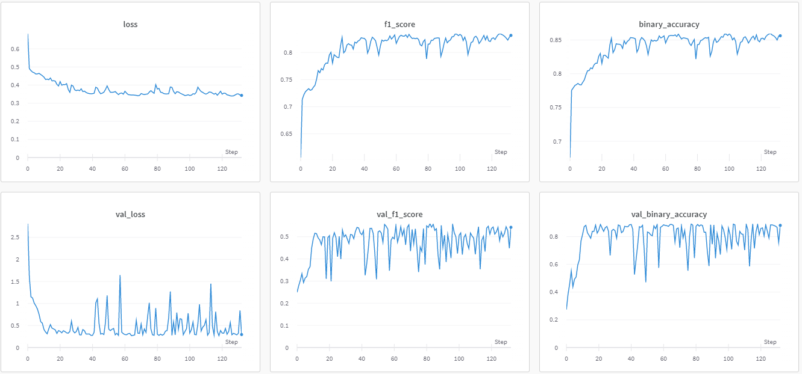
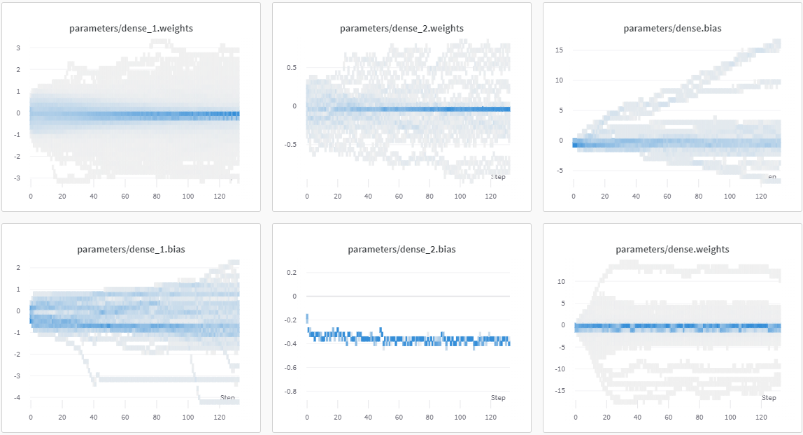
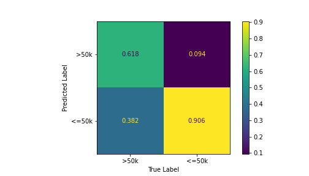

# Model Card
This work is part of the evaluation of the EEC1509 Machine Learning course of the Department of Computer Engineering and Automation Graduate Program in Electrical and Computer Engineering, Federal University of Rio Grande do Norte.

 - Developers: Francisval Guedes ([www.linkedin.com/in/francisval](https://www.linkedin.com/in/francisval-guedes-soares-6094772a)), Hareton Gomes ([www.linkedin.com/in/hareton](https://www.linkedin.com/in/hareton-ribeiro-gomes-11123a238/)).
 - Supervisor: Prof. Ivanovitch (https://www.linkedin.com/in/ivanovitchm/)

The model consists of a Multilayer Perceptron (MLP) for predicting bank marketing output results. It is an improvement of a previous work using [decision tree](https://github.com/francisvalguedes/bank_marketing/tree/master/classification).

## The data

The dataset is related with direct marketing campaigns of a Portuguese banking institution.
The *data* is from *May 2008 to November 2010* and contains information on an individual's ``marital, age, education, type of work, and more``.
The marketing campaigns were based on phone calls. Often, more than one contact to the same client was required, in order to access if the product (bank term deposit) would be *('yes') or not ('no') subscribed*.

You can download the data from the [University of California, Irvine's website](http://archive.ics.uci.edu/ml/datasets/Bank+Marketing).

Data attribute information:
   ##### Bank client data:   
   1. age (numeric)
   2. job : type of job (categorical: "admin.","unknown","unemployed","management","housemaid","entrepreneur","student",
                                       "blue-collar","self-employed","retired","technician","services") 
   3. marital : marital status (categorical: "married","divorced","single"; note: "divorced" means divorced or widowed)
   4. education (categorical: "unknown","secondary","primary","tertiary")
   5. default: has credit in default? (binary: "yes","no")
   6. balance: average yearly balance, in euros (numeric) 
   7. housing: has housing loan? (binary: "yes","no")
   8. loan: has personal loan? (binary: "yes","no")
   ##### Related with the last contact of the current campaign:
   9. contact: contact communication type (categorical: "unknown","telephone","cellular") 
  10. day: last contact day of the month (numeric)
  11. month: last contact month of year (categorical: "jan", "feb", "mar", ..., "nov", "dec")
  12. duration: last contact duration, in seconds (numeric)
   ##### Other attributes:
  13. campaign: number of contacts performed during this campaign and for this client (numeric, includes last contact)
  14. pdays: number of days that passed by after the client was last contacted from a previous campaign (numeric, -1 means client was not previously contacted)
  15. previous: number of contacts performed before this campaign and for this client (numeric)
  16. poutcome: outcome of the previous marketing campaign (categorical: "unknown","other","failure","success")
  ##### Output variable (desired target):
  17. y - has the client subscribed a term deposit? (binary: "yes","no")

## Intended Use
This model is used in predicting the outcome of a banking marketing campaign, with an entire data pipeline incorporating Machine Learning fundamentals. The data pipeline is composed of the following stages:
 - File "etl.ipynb" - Extract Load Transform (ETL) - Fetch Data, EDA and Preprocessing
 - File "data_check_segregation.ipynb" - Data Check and Data Segregation 
 - File "train_test.ipynb" - Train and Test the model

In ETL item 1.2, an Exploratory Data Analysis (EDA) is carried out, to identify the main characteristics of the dataset with the objective of subsidizing appropriate treatment decisions. It was noted that the training data is imbalanced when considered the ``target`` variable and some features as( ``default``, ``loan``, ``contact``...)

## Evaluation Data
The dataset under study is split into Train and Test during the ``Segregate`` stage of the data pipeline. 70% of the clean data is used to Train and the remaining 30% to Test. Additionally, 30% of the Train data is used for validation purposes (hyperparameter-tuning). 

## Model Details
A complete data pipeline was built using Google Colab, Visual Studio Code, Scikit-Learn, Keras, Tensorflow and Weights & Bias to train a MLP model. The big-picture of the data pipeline is shown below:

<figure>

<figcaption align = "center"><b>Fig.1 - Model big-picture</b></figcaption>
</figure>

The accentuated imbalance of the output variable led the model to a poor performance in the prediction of the minority class, getting low *recall* and *F1* score metrics. Thus, the oversample technique was implemented in the training notebook, item 1.1 (Data preparation), using *SMOTENC* to data balance.

Balancing the data with oversampling did not bring a significant improvement in the accuracy of the model, but it brought a consistent improvement in the minority class learning evidenced by the F1 Score metric shown below.

<figure>

<figcaption align = "center"><b>Fig.2 - F1 Score chart without oversampling</b></figcaption>
</figure>

<figure>

<figcaption align = "center"><b>Fig.3 - F1 Score chart with oversampling</b></figcaption>
</figure>

The graph in fig. 3 with oversampling shows a result of the validation curve much higher than that shown in fig. 2. However, a big difference is seen between the training curve and the validation of the F1 score (it does not occur in the accuracy and loss curve), this happens because the balance oversampling is applied only to the training data, and the sensitivity of the metric F1 score for the minority class little present in the validation data. Therefore, it does not consist in the occurrence of overfiting.

For prediction, 3 and 4 layer neural network models were analyzed. However, it was found that 3-layer models are sufficient for a good network performance.

For the sake of understanding, a hyperparameter-tuning was conducted using the Random Sweep of Wandb. Initially, a Sweep with a wide range of hyperparameters was defined, after analyzing the results, an improvement of the best model with a narrower range of hyperparameters was gradually carried out. The best hyperparameters values adopted in the train were:

- layer_1 = 21, (number of layer 1 neurons)
- layer_2 = 43, (number of layer 2 neurons)
- learn_rate = 0.073,
- beta_1=0.99, (Adam's beta 1)
- beta_2=0.999, (Adam's beta 2)
- batch_size = 1024,
- epoch = 500,
- dropout1 = 1.0, (1.0 - without Dropout)
- dropout2 = 1.0, (1.0 - without Dropout)
- l2_1 = 0.00001, (layer 1 - L2 normalization)
- l2_2 = 0.0001, (layer 2 - L2 normalization)
- l2_3 = 0.0, (layer 3 - L2 normalization)
- gradient_cliping = 0.5,
- bath_norm = 1, (batch normalization)

With recovery of the best model by the F1 validation score metric at epoch 82.

Other sets of hyperparameters also yield similar results. However, some observations can be made for the presented problem:

- A better performance was obtained with a number of neurons in the second layer of approximately twice the number of the first layer;

- Using oversampling to balance the data introduces noise into the data which necessitated the use of a larger batch size;

- Lower learning rates result in more gradual and smoother learning, but using bath normalization can use higher learning rates;

- The use of gradient cliping brought better results when using higher learning rates;

- The model showed low overfitting, but the use of L2 normalization led to a more limited range of weights, especially when using high learning rates;

- For the adopted model, L2 normalization led to better results than weight constriction;

- Confirming the information in the literature on the use of batch normalization, better results were obtained without the use of Dropout;

- Setting the stop earlier and for the priority metric and configuring the WandbCallback of the Wandb to restore the best model resulted in significant improvement in the final model;

Some manual executions were also performed in order to analyze the results of the Sweeps.

<figure>

<figcaption align = "center"><b>Fig.5 - Training evolution - metrics</b></figcaption>
</figure>

<figure>

<figcaption align = "center"><b>Fig.6 - Training evolution - weight </b></figcaption>
</figure>

## Metrics
In order to follow the performance of machine learning experiments, the project marked certains stage outputs of the data pipeline as metrics. The metrics adopted are: [accuracy](https://scikit-learn.org/stable/modules/generated/sklearn.metrics.accuracy_score.html), [f1](https://scikit-learn.org/stable/modules/generated/sklearn.metrics.f1_score.html#sklearn.metrics.f1_score), [precision](https://scikit-learn.org/stable/modules/generated/sklearn.metrics.precision_score.html#sklearn.metrics.precision_score), [recall](https://scikit-learn.org/stable/modules/generated/sklearn.metrics.recall_score.html#sklearn.metrics.recall_score).

To calculate the evaluations metrics is only necessary to run:

The follow results will be shown:

 **Stage [Run]**                        | **Accuracy** | **F1** | **Precision** | **Recall** | 
---------------------------------|--------------|--------|---------------|------------|
Train [sweet-sweep-16](https://wandb.ai/mlops_ivan/bank_mlp/runs/w1v7pskh/overview?workspace=user-francisvalfgs) | 0.88  | 0.83 | 0.80  |  0.86 | 
Val [sweet-sweep-16](https://wandb.ai/mlops_ivan/decision_tree_bank/runs/mbpuwfbg/overview?workspace=user-francisvalfgs)  | 0.87 | 0.56 | 0.49 | 0.65  |
Test [robust-sun-855](https://wandb.ai/mlops_ivan/bank_mlp/runs/31o42vxk/overview?workspace=user-francisvalfgs)  | 0.87 | 0.53 | 0.47 | 0.62  |

The results of the metrics obtained for the test data present better results in three of the four adopted metrics, when compared with [Decision Tree Approach](https://github.com/francisvalguedes/bank_marketing/tree/master/classification), signaling a good generalization of the model.

### Confusion matrix

The confusion matrix shown below is implemented with the test data. Where there is an improvement in the learning of the minority class compared to the first work, although there is still a reasonable percentage of false negatives.

<figure>

<figcaption align = "center"><b>Fig.5 - Confusion matrix</b></figcaption>
</figure>

## Caveats and Recommendations

When balancing the data with *SMOTENC*, a lot of noise is generated, as an improvement, other techniques can be researched in order to reduce the unwanted effects.

## References

[MITCHELL, Margaret et al. Model Cards for Model Reporting, 2019. Accessed May 30, 2022. Avaliable](https://arxiv.org/abs/1810.03993).

[University of California, Irvine's website](http://archive.ics.uci.edu/ml/datasets/Bank+Marketing).

[Bank Marketing Data - A Decision Tree Approach](https://www.kaggle.com/code/shirantha/bank-marketing-data-a-decision-tree-approach/notebook).

[Deal Banking Marketing Campaign Dataset With Machine Learning](https://medium.com/@nutanbhogendrasharma/deal-banking-marketing-campaign-dataset-with-machine-learning-9c1f84ad285d).

[Repository for EEC1509, a graduate course on PPgEEC about Machine Learning](https://github.com/ivanovitchm/ppgeecmachinelearning).
