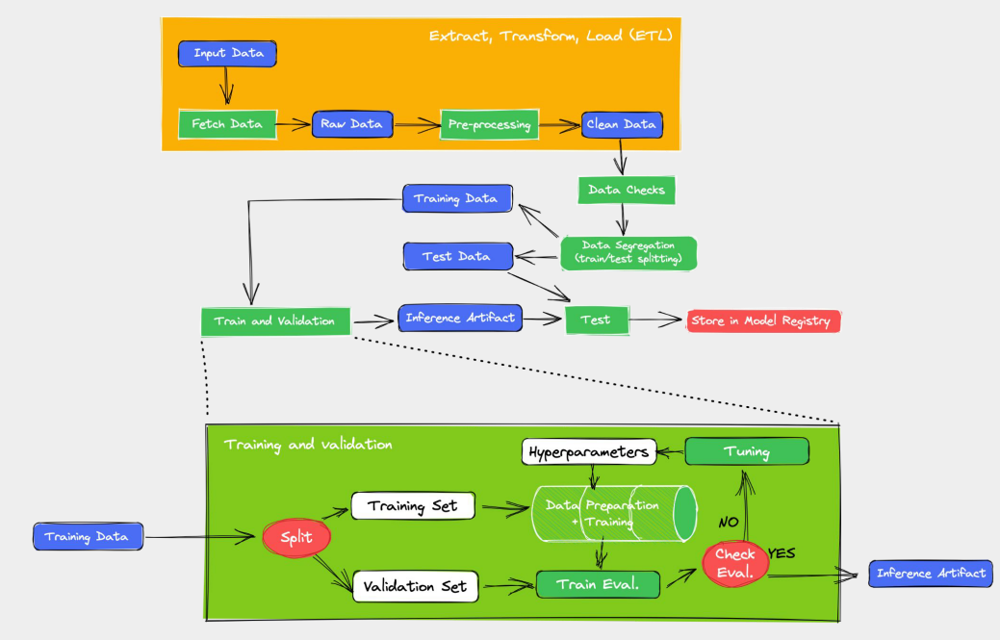

# Model Card
## Model Details
Francisval Guedes and Hareton Gomes created a Multilayer Perceptron (MLP) model supervised by Ivanovitch Silva's. A complete data pipeline was built using Google Colab, Visual Studio Code, Scikit-Learn, Keras, Tensorflow and Weights & Bias to train a Decision Tree model. The big-picture of the data pipeline is shown below:

For the sake of understanding, a simple hyperparameter-tuning was conducted using a Random Sweep of Wandb, and the best hyperparameters values adopted in the train were:

- full_pipeline__num_pipeline__num_transformer__model: 1
- classifier__criterion: 'entropy'
- classifier__splitter: 'best'
- classifier__random_state: 41
- max_depth: 6

## Intended Use
This model is used in predicting the outcome of a banking marketing campaign, with an entire data pipeline incorporating Machine Learning fundamentals. The data pipeline is composed of the following stages:
 - etl (fetch_data, eda, preprocessing)
 - data_check_segregation (data_check e data_segregation)
 - train
 - test

## Training Data

The dataset is related with direct marketing campaigns of a Portuguese banking institution.
The *data* is from *May 2008 to November 2010* and contains information on an individual's ``marital, age, education, type of work, and more``.
The marketing campaigns were based on phone calls. Often, more than one contact to the same client was required, in order to access if the product (bank term deposit) would be *('yes') or not ('no') subscribed*.

You can download the data from the University of California, Irvine's [website](http://archive.ics.uci.edu/ml/datasets/Bank+Marketing).

After the EDA stage of the data pipeline, it was noted that the training data is imbalanced when considered the target variable and some features as(``marital``, ``education``, ``default``, ``loan``, ``contact``)

## Evaluation Data
The dataset under study is split into Train and Test during the ``Segregate`` stage of the data pipeline. 70% of the clean data is used to Train and the remaining 30% to Test. Additionally, 30% of the Train data is used for validation purposes (hyperparameter-tuning). 

## Metrics
In order to follow the performance of machine learning experiments, the project marked certains stage outputs of the data pipeline as metrics. The metrics adopted are: [accuracy](https://scikit-learn.org/stable/modules/generated/sklearn.metrics.accuracy_score.html), [f1](https://scikit-learn.org/stable/modules/generated/sklearn.metrics.f1_score.html#sklearn.metrics.f1_score), [precision](https://scikit-learn.org/stable/modules/generated/sklearn.metrics.precision_score.html#sklearn.metrics.precision_score), [recall](https://scikit-learn.org/stable/modules/generated/sklearn.metrics.recall_score.html#sklearn.metrics.recall_score).

To calculate the evaluations metrics is only necessary to run:

The follow results will be shown:

 **Stage [Run]**                        | **Accuracy** | **F1** | **Precision** | **Recall** | 
---------------------------------|--------------|--------|---------------|------------|
 Train [divine-oath-174](https://wandb.ai/mlops_ivan/decision_tree_bank/runs/43pj5775/overview?workspace=user-francisvalfgs) | 0.8961       | 0.3524 | 0.6486        | 0.2419     |  
 Test [comic-dragon-175](https://wandb.ai/mlops_ivan/decision_tree_bank/runs/mbpuwfbg/overview?workspace=user-francisvalfgs)  | 0.8961       | 0.345 | 0.6578        | 0.2338     |

## Caveats and Recommendations

